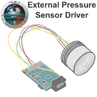

# IRT C++/ROS 2 External Pressure Sensor Driver

[](https://github.com/maximilian-nitsch/Depth-Pressure-Sensor-Driver/actions)
[](https://github.com/maximilian-nitsch/Depth-Pressure-Sensor-Driver/blob/main/LICENSE)
[](https://github.com/maximilian-nitsch/Depth-Pressure-Sensor-Driver/commits/main)
[](https://index.ros.org/doc/ros2/Installation/Humble/)
[](https://github.com/maximilian-nitsch/Depth-Pressure-Sensor-Driver/releases)
[](https://github.com/maximilian-nitsch/Depth-Pressure-Sensor-Driver/issues)
[](https://github.com/maximilian-nitsch/Depth-Pressure-Sensor-Driver/graphs/contributors)



<!--- protected region package header begins -->
**Author:**
- Maximilian Nitsch <m.nitsch@irt.rwth-aachen.de> (Institute of Automatic Control - RWTH Aachen University)

**Maintainer:**
  - Maximilian Nitsch <m.nitsch@irt.rwth-aachen.de> (Institute of Automatic Control - RWTH Aachen University)

**Contributors:**
  - Dmitrii Likhachev <dmitrii.likhachev@rwth-aachen.de> (Institute of Automatic Control - RWTH Aachen University)
<!--- protected region package header ends -->

## Description
This project provides a driver for the **KELLER 10LHPX pressure transmitter** written in C++. The sensor is connected via **RS-485 half-duplex** (serial interface), provides a subset of the **MODBUS protocol**, and supports two baudrates: **9600baud (default)** and **115200baud**. Registers must be actively requested (polling) by the master (on-board computer). The slave (sensor) provides the data.

Each sensor message has the following format:
- Address of the device
- Function code
- Optional parameters required by the function (master) or data (slave)
- 16-bit checksum

The driver implements the following features:
- Serial interface (including an emulator)
- Bus/communication protocol for X-line pressure transmitter (function codes)
- Device-dependant endianness handling
- Re-connection capability in case of connection loss
- Pressure, temperature and latency decoding and ROS 2 publishers
- Pressure to depth conversion with default or user-given conversion factor
- Status publishers using ROS 2 diagnostic messages
- Relevant parameters can be configured in a YAML file
- Unit tests

## Table of Contents

- [Dependencies](#dependencies)
- [Installation](#installation)
- [Usage](#usage)
- [ROS 2 Nodes](#ros-2-nodes)
  - [Publisher Node](#publisher-node)
  - [Subscriber Node](#subscriber-node)
- [Coding Guidelines](#coding-guidelines)
- [References](#references)
- [Contributing](#contributing)
- [License](#license)

# Dependencies

This project depends on the following literature and libraries:

- **ROS 2 Humble**: ROS 2 is a set of software libraries and tools for building robot applications: [ROS 2 Installation page](https://docs.ros.org/en/humble/Installation.html)).


# Installation

To install the `external_pressure_sensor_package`, you need to follow these steps:

1. **Install ROS 2 Humble**: Make sure you have ROS 2 (Humble) installed. You can follow the official installation instructions provided by ROS 2. Visit [ROS 2 Humble Installation page](https://docs.ros.org/en/humble/Installation.html) for detailed installation instructions tailored to your platform.

2. **Clone the Package**: Clone the package repository to your ROS 2 workspace. If you don't have a ROS 2 workspace yet, you can create one using the following commands:

    ```bash
    mkdir -p /path/to/ros2_workspace/src
    cd /path/to/ros2_workspace/src
    ```

    Now, clone the package repository:

    ```bash
    git clone <repository_url>
    ```

    Replace `<repository_url>` with the URL of your package repository.

3. **Build the Package**: Once the package is cloned, you must build it using colcon, the default build system for ROS 2. Navigate to your ROS 2 workspace and run the following command:

    ```bash
    cd /path/to/ros2_workspace
    colcon build
    ```

    This command will build all the packages in your workspace, including the newly added package.

4. **Source the Workspace**: After building the package, you need to source your ROS 2 workspace to make the package available in your ROS 2 environment. Run the following command:

    ```bash
    source /path/to/ros2_workspace/install/setup.bash
    ```

    Replace `/path/to/ros2_workspace` with the actual path to your ROS 2 workspace.

That's it! Your `external_pressure_sensor_package` should now be installed along with its dependencies and ready to use in your ROS 2 environment.

## Usage
1. **Connect your sensor** via RS-485 (Serial) and determine the serial port, i.e., using:
    ```bash
    ls /dev/tty*
    ```

2. **Configure your YAML file** for your sensor, especially the serial port, baudrate, and MODBUS device address.

3. **Start the driver** with the launch file:
    ```bash
    ros2 launch external_pressure_sensor_package depth_pressure_sensor_driver.launch.py 
    ```
    The driver prints your settings and reports if the serial connection could be established. 
    Afterwards the driver begins its main loop and actively pulls pressure, temperature and latency.

4. The sensor values should now be published.

**Important Usage Information**:
- The serial port and the baud rate must be configured correctly in the YAML file.
- The MODBUS address of the sensor must be configured correctly in the YAML file.
- Only two baudrates are supported: 9600baud (default) and 115200baud.
- The driver was tested up to a sample rate of 0.1s (10Hz). 

**Diagnostic Status Information**:
The message `/imu/diagnostic` will show the following status modes for three possible `hardware_ids` (pressure, temperature, latency):

- `STALE`: Sensor not available, the driver is trying to re-establish connection.
- `ERROR`: Serial port not successfully opened or measurement invalid.
- `WARN`: -
- `OK`: Serial interface established, sensor data ok and streaming.

## ROS 2 Nodes

The driver node implements multiple publishers and subscribes to no topic.
ROS 2 services and actions are not provided.

### Publishers

This node publishes the following topics:

| Topic Name       | Message Type        | Description                        |
|------------------|---------------------|------------------------------------|
| `.../fluid_pressure`   | `sensor_msgs/FluidPressure`   | Absolute fluid pressure in Pascal.|
| `.../depth`   | `geometry_msgs/PointStamped.msg`   | Depth in metre. Calculated with absolute fluid pressure. Position x and y are filled with zero.|
| `.../temperature`   | `sensor_msgs/Temperature.msg`   | Temperature in °C.|
| `.../latency`   | `std_msgs/Float64.msg`   | Estimated latency in seconds.|
| `.../diagnostic`   | `diagnostic_msgs/DiagnosticArray.msg`   | Diagnostic status of the driver.|

## Coding Guidelines

This project follows these coding guidelines:
- https://google.github.io/styleguide/cppguide.html
- http://docs.ros.org/en/humble/The-ROS2-Project/Contributing/Code-Style-Language-Versions.html 

## References

More information about the sensor and its communication protocol are provided by the manufacturer:
- [Series 10LHPX Product Website](https://keller-druck.com/en/products/pressure-transmitters/oem-high-pressure-transmitters/series-10lhpx)
- [Series 10LX / 10LHPX Data Sheet](https://keller-druck.com/?d=Sm55TrL7U4HK3hnRE7jxve)
- [Communication Protocol for X-Line Products](https://keller-druck.com/?d=muQjLg2dGMJAbgLYSAHreT)
- [KELLER Bus / Communication Protocols and Code Samples Overview](https://keller-druck.com/?d=EwfuUNCgN7ZMZz826XBSRS)

## Contributing

If you want to contribute to the project, see the [CONTRIBUTING](CONTRIBUTING.md) file for details.

## License

This project is licensed under the BSD-3-Clause License. See the [LICENSE](LICENSE.md) file for details.

